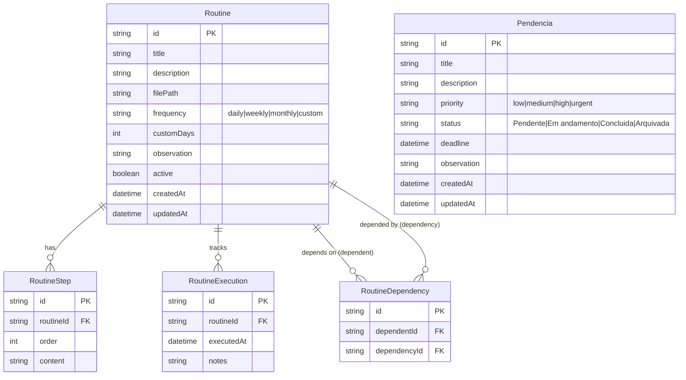

# MeetingRecorder AI — Architecture Addendum: Rotinas & Pendencias

**Versao:** 1.0
**Data:** 29/03/2026
**Autor:** Aria (Architect) — baseado no PRD Addendum v1.0
**Status:** Implementado
**Arquitetura Base:** [architecture.md](./architecture.md) v1.2

---

## 1. Scope

Este addendum documenta as extensoes arquiteturais do modulo de Rotinas & Pendencias. Nao altera nenhum padrao existente — apenas adiciona novos modelos, endpoints, componentes e paginas seguindo as mesmas convencoes.

### 1.1 Decisoes Arquiteturais

| Decisao | Rationale |
|---------|-----------|
| Status computado (nao armazenado) | Evita inconsistencia de dados — status e derivado de datas e dependencias em tempo real. Sem campo `status` no schema |
| date-fns para logica de datas | Ja existente no projeto (dependencia zero). Funcoes puras: `addDays`, `isAfter`, `startOfDay`, `isSameDay` |
| Funcao computeStatus duplicada em 2 routes | `/api/routines` e `/api/meu-dia` compartilham a mesma logica. Trade-off aceito: evita import circular e overhead de lib compartilhada para 20 linhas |
| Steps como replace (delete all + create) | Simples e correto. Evita logica de diff complexa para reordenacao |
| Inner component + key para remount | Evita `useEffect` com `setState` (lint error React 19). Dialog wrapper usa `key={id}` para forcar remount limpo |
| Pendencias separadas de Todos | Dominos distintos: Todos pertencem a reunioes, Pendencias sao avulsas. Evita poluir model Todo com campos nullable |

### 1.2 O Que NAO Mudou

- Stack tecnologica (Next.js 16, Prisma 6, Tailwind 4, shadcn/ui)
- Padroes de API route (NextRequest/NextResponse, apiError, handlePrismaError)
- Padroes de componente (glass-card, glow effects, responsive grid)
- Deploy (Vercel free tier)
- Seguranca (sem auth no MVP)
- Testing strategy

---

## 2. Data Models

### 2.1 ER Diagram (Novos Modelos)



### 2.2 Indices

| Model | Index | Rationale |
|-------|-------|-----------|
| Routine | `@@index([active])` | Filtro frequente por rotinas ativas |
| RoutineStep | `@@index([routineId])` | Join com rotina |
| RoutineExecution | `@@index([routineId])`, `@@index([executedAt])` | Busca ultima execucao |
| RoutineDependency | `@@unique([dependentId, dependencyId])` | Impede dependencia duplicada |
| Pendencia | `@@index([status])`, `@@index([priority])` | Filtros no GET |

### 2.3 Cascade Behavior

| Relacao | onDelete | Efeito |
|---------|----------|--------|
| Routine → RoutineStep | Cascade | Deletar rotina remove todos os passos |
| Routine → RoutineExecution | Cascade | Deletar rotina remove historico |
| Routine → RoutineDependency (dependent) | Cascade | Deletar rotina remove suas dependencias |
| Routine → RoutineDependency (dependency) | Cascade | Deletar rotina remove dependentes dela |

---

## 3. API Specification

### 3.1 Endpoints

#### Routines

| Method | Path | Descricao | Request Body | Response |
|--------|------|-----------|-------------|----------|
| GET | `/api/routines` | Listar rotinas ativas com status computado | — | `RoutineWithStatus[]` |
| POST | `/api/routines` | Criar rotina + steps + deps (transaction) | `CreateRoutineRequest` | `Routine` (com relacoes) |
| GET | `/api/routines/[id]` | Rotina completa com historico | — | `FullRoutine` |
| PUT | `/api/routines/[id]` | Update parcial + replace steps/deps | `Partial<CreateRoutineRequest>` | `Routine` |
| DELETE | `/api/routines/[id]` | Deletar (cascade) | — | `{success: true}` |
| POST | `/api/routines/[id]/execute` | Registrar execucao | `{notes?: string}` | `RoutineExecution` |

#### Pendencias

| Method | Path | Descricao | Request Body | Response |
|--------|------|-----------|-------------|----------|
| GET | `/api/pendencias` | Listar com filtros + counters | Query: `?status`, `?priority` | `{pendencias, counters}` |
| POST | `/api/pendencias` | Criar pendencia | `CreatePendenciaRequest` | `Pendencia` |
| PUT | `/api/pendencias/[id]` | Update parcial | `Partial<Pendencia>` | `Pendencia` |
| DELETE | `/api/pendencias/[id]` | Deletar | — | `{success: true}` |

#### Meu Dia (Dashboard)

| Method | Path | Descricao | Request Body | Response |
|--------|------|-----------|-------------|----------|
| GET | `/api/meu-dia` | Rotinas que precisam acao + pendencias ativas + counters | — | `{routines, pendencias, counters}` |

### 3.2 Logica de Status Computado

```typescript
function computeStatus(frequency, customDays, lastExec, depLastExec, today) {
  // 1. Nunca executada
  if (!lastExec) return "Pendente"

  // 2. Calcula proximo vencimento
  const intervalDays = { daily: 1, weekly: 7, monthly: 30, custom: customDays }
  const nextDue = addDays(startOfDay(lastExec), intervalDays[frequency])

  // 3. Dependencia mais recente que eu? (prioridade sobre Atrasada)
  if (depLastExec && isAfter(depLastExec, lastExec)) return "Desatualizada"

  // 4. Passou do vencimento?
  if (isAfter(startOfDay(today), nextDue)) return "Atrasada"

  // 5. Tudo certo
  return "OK"
}
```

**Prioridade de status:** Pendente > Desatualizada > Atrasada > OK

A funcao e chamada server-side nos endpoints GET `/api/routines` e GET `/api/meu-dia`. O status nunca e armazenado no banco.

### 3.3 Counters Pattern

Mesmo padrao do dashboard existente (Secao 9.5 do architecture.md):

```
GET /api/meu-dia:
  - Rotinas: computa status de TODAS, filtra as que precisam acao
  - Pendencias: groupBy status WHERE status IN ('Pendente', 'Em andamento')
  - Counters: totalRotinas, concluidasHoje (isSameDay), atrasadas, desatualizadas

GET /api/pendencias:
  - Counters: groupBy status (sem filtro) — todos os 4 sempre visiveis
  - Lista: filtrada por ?status e ?priority
```

---

## 4. Frontend Architecture

### 4.1 New Pages

```
src/app/
├── meu-dia/
│   └── page.tsx          # Dashboard diario (client component)
├── rotinas/
│   ├── page.tsx          # Lista de rotinas (client component)
│   └── [id]/
│       └── page.tsx      # Detalhe da rotina (client component)
└── pendencias/
    └── page.tsx          # Lista de pendencias (client component)
```

Todas as paginas sao **client components** (`'use client'`) seguindo o padrao do dashboard existente — fetch no useEffect, state local com useState.

### 4.2 New Components

```
src/components/
├── StatusBadge.tsx        # Badge status rotina (OK/Pendente/Atrasada/Desatualizada)
├── PriorityBadge.tsx      # Badge prioridade pendencia (Baixa/Media/Alta/Urgente)
├── RoutineCounters.tsx    # 4 cards contadores (total/hoje/atrasadas/desatualizadas)
├── ExecuteDialog.tsx      # Dialog confirmacao de execucao + notas
├── RoutineDayCard.tsx     # Card Meu Dia com expand/collapse steps
├── RoutineCard.tsx        # Card link para /rotinas/[id]
├── RoutineForm.tsx        # Dialog criar/editar rotina (Inner + wrapper com key)
├── PendenciaCard.tsx      # Card com status dropdown inline
└── PendenciaForm.tsx      # Dialog criar/editar pendencia (Inner + wrapper com key)
```

### 4.3 Component Composition

```
MeuDiaPage (/meu-dia)
├── RoutineCounters
├── RoutineDayCard[] (rotinas com status != OK)
│   └── StatusBadge, Badge (frequencia), expand/collapse steps
├── PendenciaCard[] (status Pendente/Em andamento)
│   └── PriorityBadge, Select (status inline)
└── ExecuteDialog

RotinasPage (/rotinas)
├── RoutineCard[] (todas as rotinas ativas)
│   └── StatusBadge, Badge (frequencia)
└── RoutineForm (Dialog criar)

RotinaDetailPage (/rotinas/[id])
├── StatusBadge, Badge (frequencia)
├── Steps (lista ordenada)
├── Dependencias (links bidirecionais)
├── Observacao
├── Historico de Execucoes
├── ExecuteDialog
├── RoutineForm (Dialog editar)
└── Dialog (confirmacao excluir)

PendenciasPage (/pendencias)
├── Counters (4 cards com filtro por clique)
├── PendenciaCard[] (com status dropdown)
│   └── PriorityBadge, Select (status inline)
└── PendenciaForm (Dialog criar/editar)
```

### 4.4 Sidebar Architecture

Refatorado de flat array para secoes agrupadas:

```typescript
// Antes: const navItems = [...]
// Depois:
const navSections = [
  {
    label: 'Menu',
    items: [
      { href: '/', label: 'Reunioes', icon: Home },
      { href: '/dashboard', label: 'Dashboard', icon: LayoutDashboard },
      { href: '/recording', label: 'Nova Gravacao', icon: Mic },
    ],
  },
  {
    label: 'Rotinas',
    items: [
      { href: '/meu-dia', label: 'Meu Dia', icon: CalendarCheck },
      { href: '/rotinas', label: 'Rotinas', icon: ListChecks },
      { href: '/pendencias', label: 'Pendencias', icon: ClipboardList },
    ],
  },
];
```

### 4.5 Form Pattern (Inner Component + Key)

Para evitar o lint error `react-hooks/set-state-in-effect` do React 19, os formularios usam o pattern:

```typescript
// Wrapper exportado: controla Dialog + usa key para remount
export function RoutineForm({ open, onOpenChange, routine, ...props }) {
  return (
    <Dialog open={open} onOpenChange={onOpenChange}>
      <DialogContent>
        {open && (
          <RoutineFormInner
            key={routine?.id ?? 'new'}  // Remount limpo ao trocar rotina
            routine={routine}
            {...props}
          />
        )}
      </DialogContent>
    </Dialog>
  );
}

// Inner: inicializa state no construtor, sem useEffect
function RoutineFormInner({ routine, onSubmit, ... }) {
  const [title, setTitle] = useState(routine?.title ?? '');
  // ...
}
```

---

## 5. Seed Data

3 rotinas com dados reais do fluxo de trabalho do usuario:

| Rotina | Frequencia | Filepath | Ultima Exec | Dependencia |
|--------|-----------|----------|-------------|-------------|
| Atualizar Razao | daily | R:\01 - RAZAO\... | 13/03/2026 | — |
| Atualizar Banco de Dados | daily | R:\09 - INFOS DE VENDAS\... | 16/03/2026 | — |
| Atualizar DRE | daily | R:\07 - REAL vs ORCADO\... | 13/03/2026 | Depende de Razao |

Com as datas do seed, ao acessar a aplicacao todas as rotinas aparecerao como **Atrasadas** (vencidas desde marco). O DRE tambem ficara **Desatualizado** se o Razao for executado primeiro (pois a dependencia sera mais recente).

---

## 6. Architecture Diagram (Updated)

```mermaid
graph TB
    subgraph Client["Browser (Client)"]
        UI[Next.js Frontend<br/>React + shadcn/ui]
        MR[MediaRecorder API]
        CS[Client State<br/>Wizard Flow]
        XLS[SheetJS<br/>Excel Export/Import]
    end

    subgraph Vercel["Vercel (Serverless)"]
        SSR[Next.js SSR/RSC]
        API_T[POST /api/transcribe]
        API_A[POST /api/analyze]
        API_M[/api/meetings/*]
        API_P[/api/participants/*]
        API_TD[/api/todos/*]
        API_PA[/api/pains/*]
        API_S[/api/solutions/*]
        API_I[POST /api/import]
        API_R[/api/routines/*]
        API_PE[/api/pendencias/*]
        API_MD[GET /api/meu-dia]
    end

    subgraph External["External Services"]
        WHISPER[OpenAI Whisper API]
        GPT[OpenAI GPT-4o-mini]
        NEON[(Neon PostgreSQL)]
    end

    UI --> SSR
    MR --> CS
    CS --> API_T
    CS --> API_A
    CS --> API_M
    UI --> API_P
    UI --> API_TD
    UI --> API_PA
    UI --> API_S
    UI --> API_I
    UI --> API_R
    UI --> API_PE
    UI --> API_MD
    XLS --> UI

    API_T --> WHISPER
    API_A --> GPT
    API_M --> NEON
    API_P --> NEON
    API_TD --> NEON
    API_PA --> NEON
    API_S --> NEON
    API_I --> NEON
    API_R --> NEON
    API_PE --> NEON
    API_MD --> NEON
```

---

## 7. TypeScript Interfaces

```typescript
// Types adicionados em src/lib/types.ts

type RoutineFrequency = 'daily' | 'weekly' | 'monthly' | 'custom'
type RoutineStatus = 'OK' | 'Pendente' | 'Atrasada' | 'Desatualizada'  // Computado, nao armazenado
type PendenciaPriority = 'low' | 'medium' | 'high' | 'urgent'
type PendenciaStatus = 'Pendente' | 'Em andamento' | 'Concluida' | 'Arquivada'

interface RoutineWithStatus {
  id, title, description, filePath, frequency, customDays, observation, active
  steps: RoutineStepItem[]
  executions: RoutineExecutionItem[]
  dependsOn: RoutineDependencyItem[]
  status: RoutineStatus        // Computado server-side
  lastExecution: string | null // ISO date
  nextDue: string | null       // ISO date
}

interface MeuDiaCounters {
  totalRotinas, concluidasHoje, atrasadas, desatualizadas
  pendenciasPendentes, pendenciasAndamento
}
```

---

## Change Log

| Data | Versao | Descricao | Autor |
|------|--------|-----------|-------|
| 29/03/2026 | 1.0 | Addendum arquitetural criado (retroativo) | Aria (Architect) |

---

*— Aria, arquitetando o futuro*
