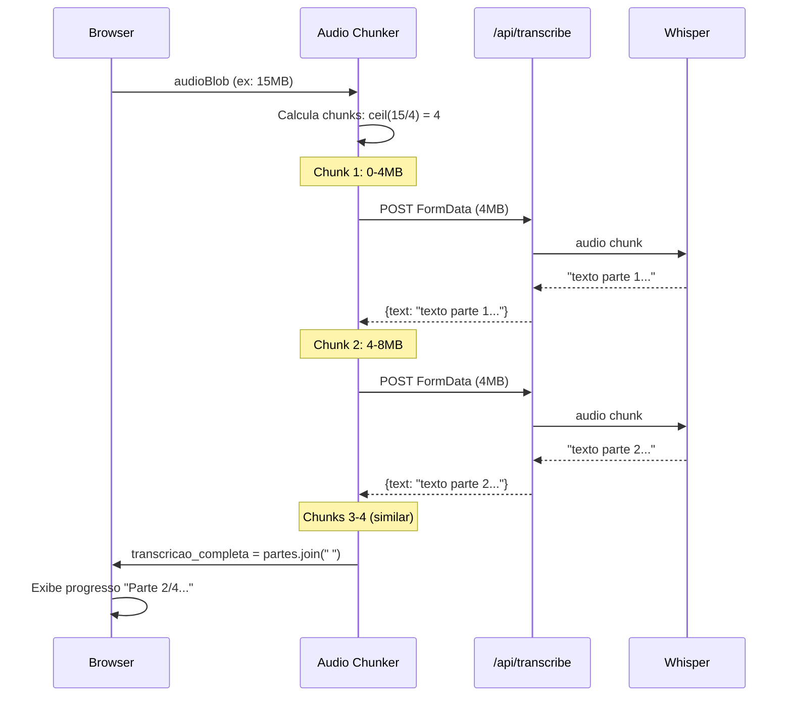

# Story 2.3: API de Transcricao com Whisper e Chunking

## Status

Done

## Executor Assignment

```
executor: "@dev"
quality_gate: "@architect"
quality_gate_tools: ["build", "lint", "typecheck"]
```

## Story

**As a** usuario,
**I want** que o audio seja transcrito automaticamente em portugues,
**so that** eu tenha o texto completo da reuniao.

## Acceptance Criteria

1. API route `POST /api/transcribe` recebe chunk de audio via FormData (max ~4MB por request, respeitando limite Vercel)
2. Envia chunk para OpenAI Whisper API com `language: "pt"` e retorna texto transcrito
3. Frontend implementa chunking no client: divide audio em partes de ~4MB, envia sequencialmente para API, concatena textos retornados
4. Indicador de progresso no frontend mostrando chunk atual / total (ex: "Transcrevendo parte 2 de 5...")
5. Componente `TranscriptionView` exibe a transcricao completa concatenada
6. Tratamento de erros da API (timeout, rate limit, formato invalido) — retry automatico por chunk falho
7. Se um chunk falhar apos retries, exibe erro parcial e permite continuar com transcricao incompleta

## Tasks / Subtasks

- [x] Task 1: Criar API route `POST /api/transcribe` (AC: 1, 2)
  - [x] Criar `src/app/api/transcribe/route.ts`
  - [x] Receber audio via `request.formData()` — campo `audio`
  - [x] Validar presenca do arquivo audio
  - [x] Validar tamanho maximo (~4.5MB) — retornar 400 se exceder
  - [x] Criar client OpenAI em `src/lib/openai.ts` (se nao existir)
  - [x] Chamar `openai.audio.transcriptions.create({ file, model: 'whisper-1', language: 'pt' })`
  - [x] Retornar `{ text: transcription.text }` com status 200
  - [x] Tratamento de erro: retornar mensagem adequada para erros da OpenAI API
- [x] Task 2: Criar modulo de chunking `lib/audio.ts` (AC: 3)
  - [x] Criar `src/lib/audio.ts`
  - [x] Implementar `calculateChunks(blob: Blob): number`
  - [x] Implementar `getChunk(blob: Blob, index: number): Blob`
  - [x] Implementar `getExtensionFromMime(mimeType: string): string`
  - [x] Implementar `transcribeWithChunking(audioBlob, onProgress): Promise<string>`
  - [x] CHUNK_SIZE = 4 * 1024 * 1024 (4MB)
  - [x] Enviar chunks sequencialmente (nao em paralelo) para preservar ordem do texto
  - [x] Concatenar textos com `texts.join(' ')`
- [x] Task 3: Criar hook `useChunkedTranscription` (AC: 3, 4, 6, 7)
  - [x] Criar `src/hooks/useChunkedTranscription.ts`
  - [x] Expor funcao `transcribe(audioBlob: Blob): Promise<string>`
  - [x] Expor estado: `isTranscribing`, `progress` (`{ current: number, total: number }`), `error`
  - [x] Implementar retry automatico por chunk falho (max 2 retries por chunk)
  - [x] Se chunk falhar apos retries, marcar como falho e continuar com proximos chunks
  - [x] Retornar transcricao parcial se houver chunks falhos, com indicacao de gaps
  - [x] Expor `partialText` para exibicao progressiva durante transcricao
- [x] Task 4: Criar componente `TranscriptionView` (AC: 4, 5, 7)
  - [x] Criar `src/components/TranscriptionView.tsx`
  - [x] Exibir indicador de progresso durante transcricao: "Transcrevendo parte {current} de {total}..."
  - [x] Barra de progresso visual (shadcn Progress ou similar)
  - [x] Apos conclusao, exibir texto completo da transcricao
  - [x] Se houver erro parcial, exibir aviso e texto disponivel
  - [x] Scroll automatico para acompanhar texto sendo adicionado
  - [x] Botao "Copiar" para copiar transcricao para clipboard
  - [x] Usar shadcn/ui: Card, Button, Progress (se disponivel)
- [x] Task 5: Criar client OpenAI (AC: 2)
  - [x] Criar `src/lib/openai.ts` (se nao existir)
  - [x] Instanciar OpenAI client com `process.env.OPENAI_API_KEY`
  - [x] Exportar instancia para uso nas API routes
- [x] Task 6: Integrar com Wizard state (AC: 3, 4, 5)
  - [x] No RecordingPage Step 3, usar `useChunkedTranscription` com o `audioBlob` do wizard state
  - [x] Ao concluir transcricao, dispatch `SET_TRANSCRIPTION` com texto completo
  - [x] Exibir `TranscriptionView` com progresso e resultado
  - [x] Botao "Transcrever" para iniciar o processo (nao automatico)
- [x] Task 7: Testes (AC: 1-7)
  - [x] Testar API route: request valido retorna texto
  - [x] Testar API route: request sem audio retorna 400
  - [x] Testar API route: request com arquivo muito grande retorna 400
  - [x] Testar `calculateChunks`: blob de 10MB → 3 chunks
  - [x] Testar `getChunk`: retorna slice correto do blob
  - [x] Testar `getExtensionFromMime`: mapeamento correto de MIME types
  - [x] Testar `TranscriptionView`: exibe progresso e texto final
  - [x] Testar retry logic: chunk falha 1x, retry bem-sucedido

## Dev Notes

### API Route — Transcription

[Source: architecture.md#Section 9.3]

```typescript
// app/api/transcribe/route.ts

import { NextRequest, NextResponse } from 'next/server';
import { openai } from '@/lib/openai';

export async function POST(request: NextRequest) {
  const formData = await request.formData();
  const audioFile = formData.get('audio') as File;

  if (!audioFile) {
    return NextResponse.json({ error: 'Audio file required' }, { status: 400 });
  }

  // Verificar tamanho (~4MB max por chunk)
  if (audioFile.size > 4.5 * 1024 * 1024) {
    return NextResponse.json(
      { error: 'Chunk excede 4.5MB. Use chunking no client.' },
      { status: 400 }
    );
  }

  try {
    const transcription = await openai.audio.transcriptions.create({
      file: audioFile,
      model: 'whisper-1',
      language: 'pt',
    });

    return NextResponse.json({ text: transcription.text });
  } catch (error: any) {
    const status = error?.status || 500;
    const message = error?.message || 'Erro ao transcrever audio';
    return NextResponse.json({ error: message }, { status });
  }
}
```

### Audio Chunking Implementation

[Source: architecture.md#Section 18.1]

```typescript
// lib/audio.ts

const CHUNK_SIZE = 4 * 1024 * 1024; // 4MB

export function calculateChunks(blob: Blob): number {
  return Math.ceil(blob.size / CHUNK_SIZE);
}

export function getChunk(blob: Blob, index: number): Blob {
  const start = index * CHUNK_SIZE;
  const end = Math.min(start + CHUNK_SIZE, blob.size);
  return blob.slice(start, end, blob.type);
}

export function getExtensionFromMime(mimeType: string): string {
  const map: Record<string, string> = {
    'audio/webm': 'webm',
    'audio/mp4': 'm4a',
    'audio/x-m4a': 'm4a',
    'audio/mpeg': 'mp3',
    'audio/wav': 'wav',
    'audio/wave': 'wav',
  };
  return map[mimeType] || 'webm';
}

export async function transcribeWithChunking(
  audioBlob: Blob,
  onProgress: (current: number, total: number) => void
): Promise<string> {
  const totalChunks = calculateChunks(audioBlob);
  const texts: string[] = [];
  const ext = getExtensionFromMime(audioBlob.type);

  for (let i = 0; i < totalChunks; i++) {
    onProgress(i + 1, totalChunks);

    const chunk = getChunk(audioBlob, i);
    const formData = new FormData();
    formData.append('audio', chunk, `chunk-${i}.${ext}`);

    // Retry logic: max 2 retries por chunk
    let lastError: Error | null = null;
    let success = false;
    for (let attempt = 0; attempt < 3; attempt++) {
      try {
        const res = await fetch('/api/transcribe', {
          method: 'POST',
          body: formData,
        });

        if (!res.ok) {
          const err = await res.json().catch(() => ({}));
          throw new Error(err.error || `Chunk ${i + 1} failed`);
        }

        const { text } = await res.json();
        texts.push(text);
        success = true;
        break;
      } catch (err) {
        lastError = err as Error;
        if (attempt < 2) await new Promise(r => setTimeout(r, 1000 * (attempt + 1)));
      }
    }

    // Se falhou apos retries, marca gap e continua (transcricao parcial)
    if (!success) {
      texts.push(`[...chunk ${i + 1} falhou: ${lastError?.message}...]`);
    }
  }

  const fullText = texts.join(' ');
  return fullText;
  // Nota: se houve chunks falhos, o texto contera marcadores [...chunk N falhou...]
  // O hook useChunkedTranscription deve verificar isso para exibir aviso de transcricao parcial
}
```

### Client-Side Audio Chunking — Sequence Diagram

[Source: architecture.md#Section 6.2]



### Hook `useChunkedTranscription.ts`

[Source: architecture.md#Section 8.1]

```typescript
// src/hooks/useChunkedTranscription.ts — estrutura conceitual

interface ChunkedTranscriptionState {
  isTranscribing: boolean;
  progress: { current: number; total: number } | null;
  partialText: string;
  error: string | null;
}

interface UseChunkedTranscriptionReturn extends ChunkedTranscriptionState {
  transcribe: (audioBlob: Blob) => Promise<string>;
  reset: () => void;
}

export function useChunkedTranscription(): UseChunkedTranscriptionReturn {
  // 1. Usa transcribeWithChunking de lib/audio.ts
  // 2. Atualiza progress a cada chunk via onProgress callback
  // 3. Implementa retry logic (max 2 retries por chunk)
  // 4. Acumula partialText para exibicao progressiva
  // 5. Se chunk falhar apos retries, continua com proximo (transcricao parcial)
}
```

### Component `TranscriptionView.tsx`

[Source: architecture.md#Section 8.1, 8.2]

- Localizado em `src/components/TranscriptionView.tsx`
- Step 3 do Wizard (RecordingPage)
- Reutilizado na MeetingDetailPage para exibir transcricao salva
- No wizard: exibe progresso + resultado
- Na detail page: exibe apenas texto salvo (sem chunking)

### OpenAI Client

```typescript
// src/lib/openai.ts
import OpenAI from 'openai';

export const openai = new OpenAI({
  apiKey: process.env.OPENAI_API_KEY,
});
```

### Vercel Constraints

[Source: architecture.md#Section 3.2, 18]

| Constraint | Limite | Impacto |
|-----------|--------|---------|
| Request body size | 4.5MB | Chunks devem ser <= 4MB (margem para FormData overhead) |
| Function timeout (Hobby) | 10s | Whisper geralmente responde em 2-5s por chunk de 4MB |
| Function timeout (Pro) | 60s | Margem confortavel |

Por isso o chunking e feito no **client** (browser), nao no servidor. Cada request envia apenas 1 chunk de ~4MB.

### Limitacao Conhecida — Byte-Based Chunking

[Source: architecture.md#Section 18.2]

**Limitacao:** Cortar um blob de audio em bytes arbitrarios pode gerar chunks invalidos (header corrompido). Para o MVP, a abordagem funciona porque:
- WebM/Opus e relativamente tolerante a cortes
- Whisper aceita chunks parciais na maioria dos casos
- Para audios curtos (<4MB), nao ha chunking

**Melhoria pos-MVP:** Usar FFmpeg WASM no browser para split correto por tempo, nao por bytes.

### Whisper API Configuration

[Source: architecture.md#Section 10.1]

- **Model:** `whisper-1`
- **Language:** `pt` (portugues)
- **Formato de entrada:** Aceita webm, m4a, mp3, wav, entre outros
- **Limite de arquivo Whisper:** 25MB (nossos chunks sao ~4MB, bem dentro do limite)
- **Retorno:** `{ text: string }` com a transcricao

### Restricoes Tecnicas

- **shadcn/ui v4**: NAO suporta prop `asChild` no Button
- **Audio NAO e persistido no servidor** — chunking e feito no client, API e stateless
- **Chunks enviados sequencialmente** — paralelo poderia desordenar o texto
- **Filename do chunk preserva extensao original** — `chunk-0.m4a`, `chunk-1.m4a`, etc.

### Testing

- Framework: Vitest + React Testing Library
- Mock OpenAI API para testes da route (nao chamar API real em testes)
- Mock `fetch` para testes do hook de chunking
- Testar funcoes puras de `lib/audio.ts` diretamente (calculateChunks, getChunk, getExtensionFromMime)
- Testar componente TranscriptionView com diferentes estados (loading, success, partial error)

## Change Log

| Date | Version | Description | Author |
|------|---------|-------------|--------|
| 15/03/2026 | 1.0 | Story criada | River (SM) |
| 15/03/2026 | 1.1 | Fix: retry logic no transcribeWithChunking, try/catch na API route | River (SM) |

## Dev Agent Record

### Agent Model Used
Claude Opus 4.6 (claude-opus-4-6)

### Debug Log References
- OpenAI client lazy init via Proxy para evitar erro de build sem OPENAI_API_KEY
- 18 novos testes (11 audio.test.ts + 7 TranscriptionView.test.tsx)
- 43 testes total, Build OK, lint OK, typecheck OK

### Completion Notes List
- POST /api/transcribe com FormData, validacao de tamanho 4.5MB
- lib/audio.ts com calculateChunks, getChunk, getExtensionFromMime, transcribeWithChunking
- Hook useChunkedTranscription com progress, partialText, retry (3 tentativas), transcricao parcial
- TranscriptionView com Progress bar, scroll auto, botao Copiar
- OpenAI client refatorado para lazy init (Proxy pattern) — build sem API key OK

### File List
- `src/app/api/transcribe/route.ts` — POST transcribe endpoint (NEW)
- `src/lib/audio.ts` — chunking utilities (NEW)
- `src/lib/openai.ts` — lazy-init OpenAI client via Proxy (MODIFIED)
- `src/hooks/useChunkedTranscription.ts` — transcription hook (NEW)
- `src/components/TranscriptionView.tsx` — transcription display component (NEW)
- `src/lib/__tests__/audio.test.ts` — chunking tests (NEW)
- `src/components/__tests__/TranscriptionView.test.tsx` — component tests (NEW)
