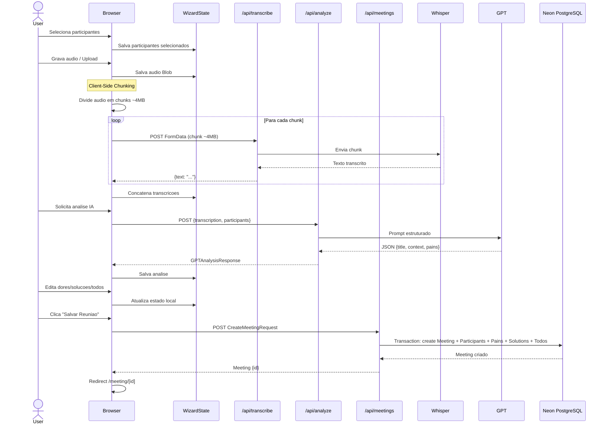

# Story 4.3: Fluxo Wizard da Pagina de Gravacao

## Status

Done

## Executor Assignment

```
executor: "@dev"
quality_gate: "@architect"
quality_gate_tools: ["build", "lint", "typecheck"]
```

## Story

**As a** usuario,
**I want** que a pagina de gravacao me guie passo a passo pelo fluxo completo,
**so that** eu nao me perca entre as etapas.

## Acceptance Criteria

1. Pagina `/recording` implementa wizard com etapas sequenciais: (a) Participantes, (b) Gravacao/Upload, (c) Transcricao, (d) Analise IA, (e) Dores/Solucoes, (f) Tabela de To-Do, (g) Salvar
2. Indicador visual de progresso mostrando etapa atual (stepper/breadcrumb)
3. Botoes "Proximo" e "Voltar" para navegar entre etapas
4. State management local (React state) mantendo dados entre etapas — nenhuma persistencia no banco ate o save final
5. Etapa (g) "Salvar": campo de titulo (pre-preenchido pelo GPT, editavel), botao "Salvar Reuniao" que persiste tudo via `POST /api/meetings`
6. Apos salvar, redireciona para `/meeting/[id]` (pagina de detalhes)
7. Se analise GPT falhar (FR34), permitir pular para preenchimento manual de dores/to-dos
8. Tratamento de loading states em cada etapa (transcricao e analise podem demorar)

## Tasks / Subtasks

- [x] Task 1: Criar hook useWizard (AC: 4)
  - [x] Criar `src/hooks/useWizard.ts`
  - [x] Implementar `useReducer` com `WizardState` e `WizardAction`
  - [x] Implementar reducer com todos os action types
  - [x] Implementar funcao `wizardReducer` com switch/case
  - [x] Expor state e dispatch, mais helpers (nextStep, prevStep, canProceed)
- [x] Task 2: Criar componente WizardStepper (AC: 2)
  - [x] Criar `src/components/WizardStepper.tsx`
  - [x] Exibir todas as 7 etapas com indicador visual da etapa atual
  - [x] Marcar etapas completas, atual e futuras com estilos distintos
  - [x] Responsivo (mobile-friendly)
- [x] Task 3: Criar pagina /recording com estrutura wizard (AC: 1, 3)
  - [x] Criar `src/app/recording/page.tsx`
  - [x] Usar `'use client'` (componente interativo)
  - [x] Integrar useWizard hook
  - [x] Renderizar WizardStepper no topo
  - [x] Renderizar componente da etapa atual condicionalmente
  - [x] Botoes "Proximo" e "Voltar" no rodape de cada etapa
- [x] Task 4: Integrar Step 1 — Participantes (AC: 1a)
  - [x] Renderizar ParticipantSelector (Story 3.2) na etapa 'participants'
  - [x] Conectar selecao ao wizard state via SET_PARTICIPANTS
  - [x] "Proximo" habilitado quando pelo menos 1 participante selecionado
- [x] Task 5: Integrar Step 2 — Gravacao/Upload (AC: 1b, 8)
  - [x] Renderizar AudioRecorder (Story 2.1) e AudioUpload (Story 2.2)
  - [x] Conectar audio blob ao wizard state via SET_AUDIO
  - [x] "Proximo" habilitado quando audio disponivel
- [x] Task 6: Integrar Step 3 — Transcricao (AC: 1c, 8)
  - [x] Renderizar TranscriptionView (Story 2.3) com progresso de chunking
  - [x] Iniciar transcricao automaticamente ao entrar na etapa
  - [x] Loading state com indicador de progresso ("Parte 2/4...")
  - [x] Conectar resultado ao wizard state via SET_TRANSCRIPTION
  - [x] "Proximo" habilitado quando transcricao completa
- [x] Task 7: Integrar Step 4 — Analise IA (AC: 1d, 7, 8)
  - [x] Disparar `POST /api/analyze` automaticamente ao entrar na etapa
  - [x] Loading state enquanto GPT processa
  - [x] Conectar resultado ao wizard state via SET_ANALYSIS
  - [x] Se falhar (FR34): exibir opcoes "Tentar novamente" ou "Preencher manualmente"
  - [x] "Preencher manualmente" avanca com dores/solucoes/todos vazios
- [x] Task 8: Integrar Step 5 — Dores/Solucoes (AC: 1e)
  - [x] Renderizar AnalysisView (Story 3.4) em modo editavel
  - [x] Conectar edicoes ao wizard state via SET_PAINS
- [x] Task 9: Integrar Step 6 — Tabela de To-Do (AC: 1f)
  - [x] Renderizar TodoTable (Story 4.2) em modo wizard (client state)
  - [x] Conectar edicoes ao wizard state via SET_TODOS
- [x] Task 10: Integrar Step 7 — Salvar (AC: 5, 6)
  - [x] Campo de titulo pre-preenchido pelo GPT (`analysis.title`), editavel
  - [x] Conectar titulo ao wizard state via SET_TITLE
  - [x] Botao "Salvar Reuniao" que monta `CreateMeetingRequest` e chama `POST /api/meetings`
  - [x] Loading state durante save
  - [x] Apos sucesso: `router.push(/meeting/${id})`
- [x] Task 11: Testar fluxo completo (AC: 1-8)
  - [x] Verificar navegacao entre todas as etapas (15 hook tests)
  - [x] Verificar que dados persistem entre etapas (state local)
  - [x] Verificar fallback manual quando GPT falha
  - [x] Verificar que build e lint passam

## Dev Notes

### Hook useWizard com useReducer

[Source: architecture.md#Section 8.3]

```typescript
// hooks/useWizard.ts

type WizardAction =
  | { type: 'SET_STEP'; step: WizardStep }
  | { type: 'SET_PARTICIPANTS'; participants: Participant[] }
  | { type: 'SET_AUDIO'; blob: Blob; fileName?: string }
  | { type: 'SET_TRANSCRIPTION'; text: string }
  | { type: 'SET_ANALYSIS'; analysis: GPTAnalysisResponse }
  | { type: 'UPDATE_PAIN'; index: number; pain: EditablePain }
  | { type: 'ADD_PAIN'; pain: EditablePain }
  | { type: 'REMOVE_PAIN'; index: number }
  | { type: 'UPDATE_TODO'; index: number; todo: EditableTodo }
  | { type: 'ADD_TODO'; todo: EditableTodo }
  | { type: 'REMOVE_TODO'; index: number }
  | { type: 'SET_TITLE'; title: string }
  | { type: 'RESET' };

function wizardReducer(state: WizardState, action: WizardAction): WizardState {
  // Switch on action.type, return new state
}
```

### WizardState e WizardStep Types

[Source: architecture.md#Section 4.2]

```typescript
// lib/types.ts

export interface WizardState {
  step: WizardStep;
  selectedParticipants: Participant[];
  audioBlob: Blob | null;
  audioFileName: string | null;
  transcription: string | null;
  analysis: GPTAnalysisResponse | null;
  editedPains: EditablePain[];
  editedTodos: EditableTodo[];
  title: string | null;
}

export type WizardStep =
  | 'participants'
  | 'recording'
  | 'transcription'
  | 'analysis'
  | 'pains-solutions'
  | 'todos'
  | 'save';
```

### Component Hierarchy

[Source: architecture.md#Section 8.2]

```
RecordingPage (/recording) — WIZARD
├── WizardStepper (indicador de etapas)
├── Step 1: ParticipantSelector        (Story 3.2)
├── Step 2: AudioRecorder | AudioUpload (Story 2.1 / 2.2)
├── Step 3: TranscriptionView           (Story 2.3) — com progresso chunking
├── Step 4: AnalysisView                (Story 3.4) — loading → resultado
├── Step 5: AnalysisView                (Story 3.4) — dores/solucoes editaveis
├── Step 6: TodoTable                   (Story 4.2) — pre-preenchida, editavel, client state
└── Step 7: SaveForm (titulo + botao salvar)
```

### Sequence Diagram — Wizard Flow

[Source: architecture.md#Section 6.1]



### Save — Monta CreateMeetingRequest

[Source: architecture.md#Section 4.2]

Na etapa "Salvar", o frontend deve montar o `CreateMeetingRequest` a partir do wizard state:

```typescript
const request: CreateMeetingRequest = {
  title: state.title,
  date: new Date().toISOString(),
  transcription: state.transcription!,
  context: state.analysis?.context || null,
  participantIds: state.selectedParticipants.map(p => p.id),
  pains: state.editedPains.map(pain => ({
    description: pain.description,
    solutions: pain.solutions.map(s => s.description),
    todos: state.editedTodos
      .filter(t => t.painTempId === pain.tempId)
      .map(t => ({
        action: t.action,
        responsible: t.responsible || undefined,
        actionOwner: t.actionOwner || undefined,
        costCenter: t.costCenter || undefined,
        account: t.account || undefined,
        deadline: t.deadline || undefined,
        meetingDate: new Date().toISOString(),
      })),
  })),
  orphanTodos: state.editedTodos
    .filter(t => !t.painTempId)
    .map(t => ({
      action: t.action,
      responsible: t.responsible || undefined,
      actionOwner: t.actionOwner || undefined,
      costCenter: t.costCenter || undefined,
      account: t.account || undefined,
      deadline: t.deadline || undefined,
      meetingDate: new Date().toISOString(),
    })),
};
```

### GPT Fallback (FR34)

[Source: architecture.md#Section 17.3]

Se a analise GPT falhar ou retornar JSON invalido:
1. API retorna status 422 com `{ error: "...", raw: "..." }`
2. Frontend exibe mensagem: "A analise IA falhou. Deseja tentar novamente ou preencher manualmente?"
3. Opcao "Tentar novamente" → re-envia para `/api/analyze`
4. Opcao "Preencher manualmente" → avanca no wizard com dores/solucoes/todos vazios para preenchimento manual

### Participantes vs Wizard State

[Source: architecture.md#Section 8.3]

O cadastro de participantes e **global** — nao faz parte dos dados da reuniao. Quando o usuario digita um nome novo no `ParticipantSelector`, o componente cria o participante **imediatamente** via `POST /api/participants`. O wizard armazena apenas os `participantIds` selecionados no client state. O link `MeetingParticipant` e criado no save final (`POST /api/meetings`).

### Restricoes Criticas

- **Nenhuma persistencia no banco ate o save final** (FR30) — todos os dados vivem no client state via useReducer
- **Excecao:** cadastro de participantes e global e persiste imediatamente
- **`'use client'`** obrigatorio na pagina (interatividade pesada)
- **Loading states** sao essenciais — transcricao e analise podem levar varios segundos

### Testing

- Verificar navegacao sequencial entre etapas
- Verificar que dados persistem no state entre etapas
- Verificar fallback quando analise GPT falha
- Verificar que save monta CreateMeetingRequest corretamente
- Verificar redirect apos save
- Verificar que `npm run build` e `npm run lint` passam

## Change Log

| Date | Version | Description | Author |
|------|---------|-------------|--------|
| 15/03/2026 | 1.0 | Story criada | River (SM) |

## Dev Agent Record

### Agent Model Used
Claude Opus 4.6

### Debug Log References
- No issues encountered

### Completion Notes List
- WizardState/WizardStep types added to types.ts
- useWizard hook with useReducer pattern, 9 action types, canProceed logic per step
- WizardStepper with visual progress indicator, responsive (hidden labels on mobile)
- Recording page rewired from placeholder to full 7-step wizard
- Auto-start transcription when entering step 3 (via useEffect + ref guard)
- Auto-start analysis when entering step 4 (same pattern)
- FR34 fallback: "Tentar novamente" / "Preencher manualmente" on analysis failure
- Save builds CreateMeetingRequest from wizard state, posts to API, redirects to /meeting/[id]
- Todos auto-populated from GPT analysis with CC auto-fill from participants
- 15 useWizard hook tests, 93 total tests passing
- Build OK with /recording now as dynamic (client component)

### File List
| File | Action | Description |
|------|--------|-------------|
| src/lib/types.ts | Modified | Added WizardState, WizardStep types |
| src/hooks/useWizard.ts | Created | Wizard state management with useReducer |
| src/components/WizardStepper.tsx | Created | Visual step indicator component |
| src/app/recording/page.tsx | Modified | Full 7-step wizard implementation |
| src/hooks/__tests__/useWizard.test.ts | Created | 15 hook tests |
