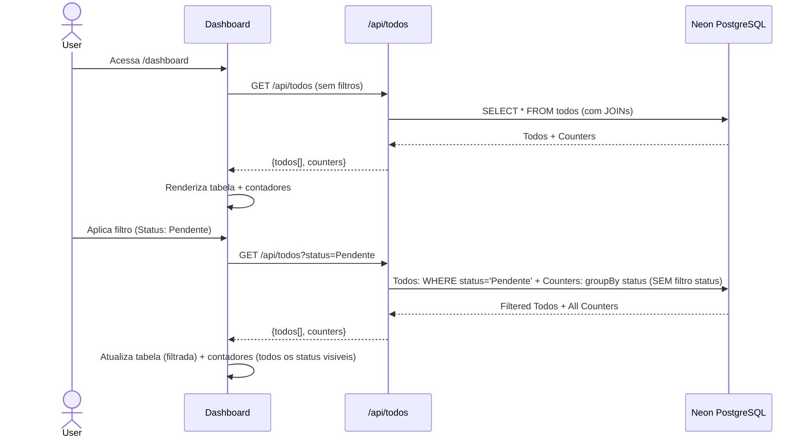

# Story 5.1: Dashboard com Filtros e Contadores

## Status

Done

## Executor Assignment

```
executor: "@dev"
quality_gate: "@architect"
quality_gate_tools: ["build", "lint", "typecheck"]
```

## Story

**As a** usuario,
**I want** um dashboard com todos os to-dos consolidados e filtros,
**so that** eu tenha visao geral de todas as acoes pendentes entre reunioes.

## Acceptance Criteria

1. Pagina `/dashboard` com contadores no topo: Pendentes (amarelo), Em andamento (azul), Concluidos (verde), Cancelados (vermelho)
2. Filtros: Centro de custo, Responsavel, Resp. pela acao, Status, Periodo (de/ate), Conta
3. Filtros executados no backend (query parametrizada no Prisma)
4. Tabela unificada de to-dos com coluna extra: reuniao de origem (link)
5. Tabela editavel (mesmo componente TodoTable)
6. Contadores atualizam ao aplicar filtros
7. Componentes `DashboardFilters` e `DashboardCounters`
8. Botoes "Exportar Excel" e "Importar Excel" no topo da pagina

## Tasks / Subtasks

- [x] Task 1: Criar pagina do dashboard (AC: 1, 7)
  - [x] Criar `src/app/dashboard/page.tsx` com layout do dashboard
  - [x] Implementar componente `DashboardCounters.tsx` com 4 cards coloridos (Pendente: amarelo, Em andamento: azul, Concluido: verde, Cancelado: vermelho)
  - [x] Usar shadcn/ui Card para cada contador
- [x] Task 2: Implementar filtros (AC: 2, 3, 7)
  - [x] Criar componente `DashboardFilters.tsx`
  - [x] Adicionar filtros: Centro de custo (Input), Responsavel (Input), Resp. pela acao (Input), Status (Select), Periodo de/ate (Calendar/Popover), Conta (Input)
  - [x] Conectar filtros a query params via `GET /api/todos`
- [x] Task 3: Verificar API route GET /api/todos com filtros (AC: 3, 6)
  - [x] O arquivo `src/app/api/todos/route.ts` ja foi criado na Story 4.1 (Task 7) com GET handler completo incluindo filtros e counters
  - [x] Verificar que o handler GET implementa baseWhere (SEM status) para counters e todosWhere (COM status) para lista
  - [x] Verificar que retorna `{todos: Todo[], counters: DashboardCounters}`
  - [x] Se necessario, ajustar o handler existente para atender os ACs desta story
- [x] Task 4: Tabela unificada com coluna de reuniao (AC: 4, 5)
  - [x] Reutilizar componente `TodoTable` em modo conectado a API
  - [x] Adicionar coluna extra "Reuniao" com link para `/meeting/[id]`
  - [x] Integrar edicao inline via `PUT /api/todos/[id]`
- [x] Task 5: Contadores dinamicos (AC: 6)
  - [x] Contadores recalculam ao aplicar qualquer filtro
  - [x] Counters usam groupBy com baseWhere (SEM filtro de status) — todos os 4 valores sempre visiveis
- [x] Task 6: Botoes de Excel como placeholders (AC: 8)
  - [x] Adicionar botao "Exportar Excel" (placeholder — implementado na Story 5.2)
  - [x] Adicionar botao "Importar Excel" (placeholder — implementado na Story 5.3)
- [x] Task 7: Verificar build e lint
  - [x] Executar `npm run build` — deve compilar sem erros
  - [x] Executar `npm run lint` — deve passar sem erros

## Dev Notes

### Estrutura de Componentes

[Source: architecture.md#Section 8.2]

```
DashboardPage (/dashboard)
├── DashboardCounters (4 cards coloridos)
├── DashboardFilters (dropdowns + date pickers)
├── TodoTable (editavel, conectado a API)
├── ExcelExport (respeita filtros)
└── ExcelImport
```

### Arquivos a Criar/Modificar

- `src/app/dashboard/page.tsx` — Pagina principal do dashboard
- `src/components/DashboardFilters.tsx` — Componente de filtros
- `src/components/DashboardCounters.tsx` — Componente de contadores
- `src/app/api/todos/route.ts` — API route GET com filtros

### TypeScript Interfaces

[Source: architecture.md#Section 4.2]

```typescript
export interface DashboardFilters {
  costCenter?: string;
  responsible?: string;
  actionOwner?: string;
  status?: TodoStatus;
  dateFrom?: string;
  dateTo?: string;
  account?: string;
}

export interface DashboardCounters {
  pendente: number;
  emAndamento: number;
  concluido: number;
  cancelado: number;
}
```

### CRITICAL BEHAVIOR: Counters vs Lista (baseWhere / todosWhere)

[Source: architecture.md#Section 9.5]

Os contadores usam `groupBy` com `baseWhere` (SEM filtro de status) para que todos os 4 contadores permanecam visiveis quando o usuario filtra por status. A lista de to-dos usa `todosWhere` (COM filtro de status). Isso garante que ao filtrar por "Pendente", os cards de "Em andamento", "Concluido" e "Cancelado" continuam mostrando seus valores reais.

### API Route Completa: GET /api/todos

[Source: architecture.md#Section 9.5]

```typescript
// app/api/todos/route.ts — GET handler

export async function GET(request: NextRequest) {
  const { searchParams } = new URL(request.url);

  // Filtros SEM status (para counters)
  const baseWhere: any = {};

  if (searchParams.get('responsible')) baseWhere.responsible = { contains: searchParams.get('responsible'), mode: 'insensitive' };
  if (searchParams.get('actionOwner')) baseWhere.actionOwner = { contains: searchParams.get('actionOwner'), mode: 'insensitive' };
  if (searchParams.get('costCenter')) baseWhere.costCenter = { contains: searchParams.get('costCenter'), mode: 'insensitive' };
  if (searchParams.get('account')) baseWhere.account = { contains: searchParams.get('account'), mode: 'insensitive' };

  if (searchParams.get('dateFrom') || searchParams.get('dateTo')) {
    baseWhere.meetingDate = {};
    if (searchParams.get('dateFrom')) baseWhere.meetingDate.gte = new Date(searchParams.get('dateFrom')!);
    if (searchParams.get('dateTo')) baseWhere.meetingDate.lte = new Date(searchParams.get('dateTo')!);
  }

  // Filtro COM status (para lista de todos)
  const todosWhere = { ...baseWhere };
  if (searchParams.get('status')) todosWhere.status = searchParams.get('status');

  // Counters usam baseWhere (SEM filtro de status) — assim todos os 4 contadores
  // sempre mostram valores reais, mesmo quando o usuario filtra por status
  const [todos, statusCounts] = await Promise.all([
    prisma.todo.findMany({
      where: todosWhere,
      include: { meeting: { select: { id: true, title: true } }, pain: { select: { description: true } } },
      orderBy: { meetingDate: 'desc' },
    }),
    prisma.todo.groupBy({
      by: ['status'],
      where: baseWhere,
      _count: true,
    }),
  ]);

  // Montar counters a partir do groupBy
  const counters = { pendente: 0, emAndamento: 0, concluido: 0, cancelado: 0 };
  for (const row of statusCounts) {
    if (row.status === 'Pendente') counters.pendente = row._count;
    else if (row.status === 'Em andamento') counters.emAndamento = row._count;
    else if (row.status === 'Concluido') counters.concluido = row._count;
    else if (row.status === 'Cancelado') counters.cancelado = row._count;
  }

  return NextResponse.json({ todos, counters });
}
```

### Diagrama de Sequencia: Dashboard Filtering

[Source: architecture.md#Section 6.3]



### TodoTable Reutilizado

O componente `TodoTable` e reutilizado em modo conectado a API. No dashboard, adicionar coluna extra "Reuniao" com link para `/meeting/[id]` usando os dados de `todo.meeting.id` e `todo.meeting.title` retornados pelo `include` da query.

### ExcelExport e ExcelImport (Placeholders)

Nesta story, os botoes "Exportar Excel" e "Importar Excel" sao adicionados no topo da pagina como placeholders visuais. A implementacao real sera feita nas Stories 5.2 e 5.3 respectivamente.

### Componentes shadcn/ui Utilizados

- **Card** — contadores de status
- **Select** — filtro de status
- **Calendar + Popover** — filtro de periodo (date range)
- **Input** — filtros de texto (responsavel, centro de custo, conta)
- **Button** — aplicar filtros, exportar/importar Excel

### Restricoes Tecnicas

[Source: architecture.md#Section 3.1]

- **shadcn/ui v4**: NAO suporta prop `asChild` no Button. Para file uploads usar `onClick` + hidden `<input type="file">`
- **Select.onValueChange**: Pode retornar null. Guard com `(v) => v && handler(v)`
- **TypeScript strict mode**: Obrigatorio

### Testing

- Verificar que dashboard carrega sem erros com `npm run dev`
- Verificar que filtros enviam query params corretas para a API
- Verificar que contadores refletem valores corretos (baseWhere sem status)
- Verificar que tabela exibe coluna de reuniao com link funcional
- `npm run build` deve compilar sem erros
- `npm run lint` deve passar sem erros

## Change Log

| Date | Version | Description | Author |
|------|---------|-------------|--------|
| 15/03/2026 | 1.0 | Story criada | River (SM) |
| 15/03/2026 | 1.1 | Fix: Task 3 referencia arquivo existente da 4.1, typecheck adicionado | River (SM) |

## Dev Agent Record

### Agent Model Used
Claude Opus 4.6

### Debug Log References
- No issues encountered

### Completion Notes List
- DashboardCounters component with 4 colored cards (yellow/blue/green/red)
- DashboardFilters component with 7 filter fields (responsible, actionOwner, costCenter, account, status Select, dateFrom/dateTo date inputs)
- Dashboard page fetches from GET /api/todos with query params, re-fetches on Apply
- API already implemented in Story 4.1 with baseWhere/todosWhere pattern
- TodoTable enhanced with optional meetingLinks prop for "Reunião" column with links
- DashboardFiltersState type added to types.ts
- MeetingListItem type added to types.ts
- Inline editing via PUT /api/todos/[id] on dashboard
- Export/Import Excel placeholder buttons
- Build OK, lint OK, typecheck OK, 93 tests passing

### File List
| File | Action | Description |
|------|--------|-------------|
| src/lib/types.ts | Modified | Added DashboardFiltersState, MeetingListItem interfaces |
| src/components/DashboardCounters.tsx | Created | 4 colored counter cards |
| src/components/DashboardFilters.tsx | Created | Filter form with 7 fields |
| src/components/TodoTable.tsx | Modified | Added meetingLinks prop and Reunião column |
| src/app/dashboard/page.tsx | Modified | Full dashboard with counters, filters, todo table |
